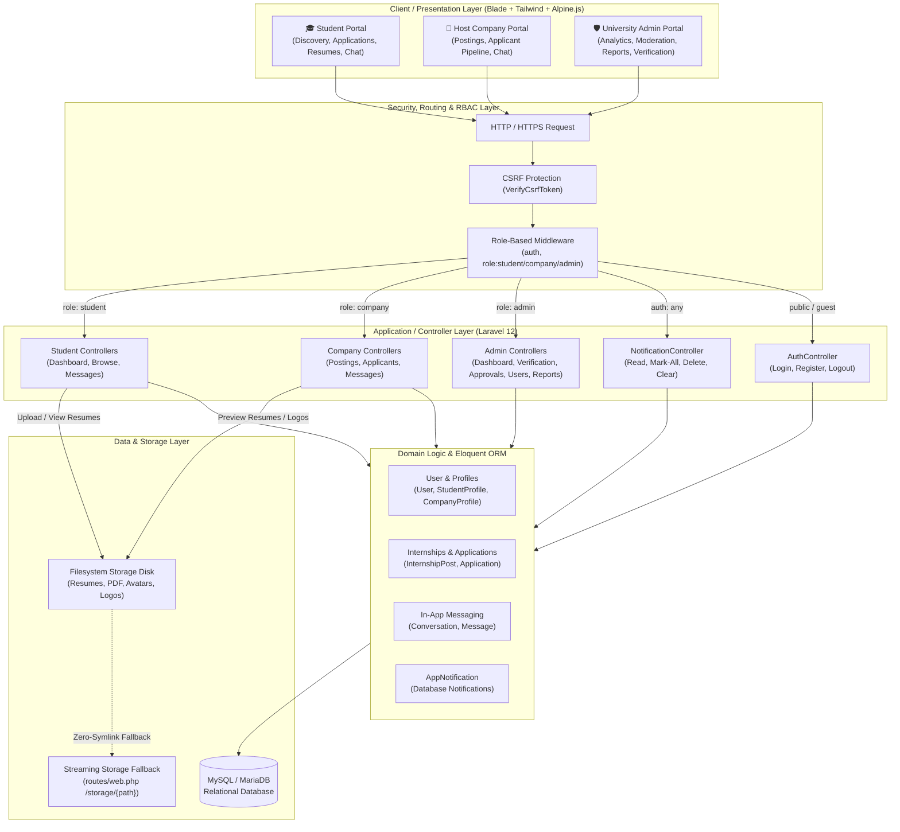
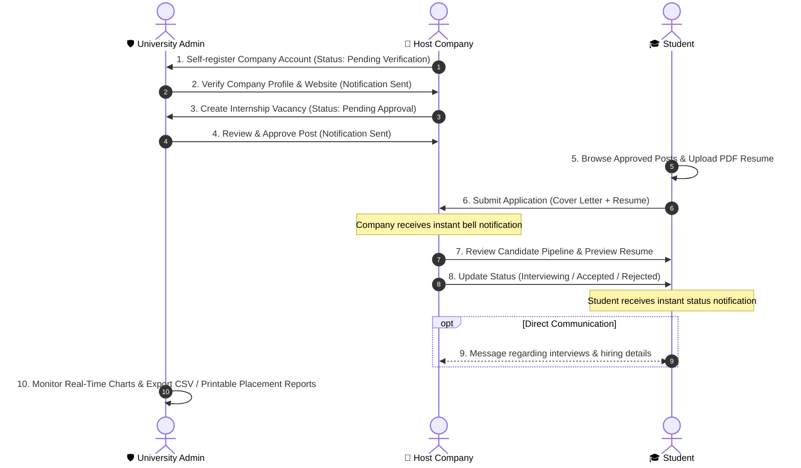

# 🎓 Internship Management System (IMS)

[](https://laravel.com)
[](https://www.php.net)
[](https://tailwindcss.com)
[](https://alpinejs.dev)
[](https://vitejs.dev)
[](https://www.mysql.com)
[-success?style=for-the-badge&logo=checkmarx&logoColor=white)](https://github.com/thonpheara/InternshipMS)
[](https://opensource.org/licenses/MIT)

**Internship Management System** is a unified, enterprise-grade web application built with **Laravel 12**, **Tailwind CSS**, **Alpine.js**, **Chart.js**, and **Vite**. It bridges the gap between university students, host employers, and university administrators to streamline internship discovery, candidate applications, corporate verification, job post moderation, in-app messaging, placement reporting, and institutional analytics.

🔗 **GitHub Repository:** [https://github.com/thonpheara/InternshipMS.git](https://github.com/thonpheara/InternshipMS.git)

---

## 📋 Table of Contents
- [✨ Key Features & Role Portals](#-key-features--role-portals)
  - [🎓 Student Portal](#-student-portal)
  - [🏢 Host Company Portal](#-host-company-portal)
  - [🛡️ University Administrator Portal](#-university-administrator-portal)
  - [🔔 Universal In-App Notification System](#-universal-in-app-notification-system)
- [🏗️ System Architecture & Workflow](#-system-architecture--workflow)
  - [1. High-Level Architectural Diagram](#1-high-level-architectural-diagram)
  - [2. End-to-End Business Process Sequence](#2-end-to-end-business-process-sequence)
  - [3. Role-Based Access Control (RBAC) Matrix](#3-role-based-access-control-rbac-matrix)
  - [4. Layered Architectural Breakdown](#4-layered-architectural-breakdown)
- [💻 System Requirements](#-system-requirements)
- [🚀 Step-by-Step Installation & Setup](#-step-by-step-installation--setup)
- [🏃 Running the Application Locally](#-running-the-application-locally)
- [🧪 Running Automated Tests](#-running-automated-tests)
- [🔑 Default Login Credentials & Access](#-default-login-credentials--access)
- [📂 Project Directory Structure](#-project-directory-structure)
- [🔄 Updating the Project After Changes](#-updating-the-project-after-changes)
- [🛠️ Useful Commands & Troubleshooting](#️-useful-commands--troubleshooting)
- [📄 License](#-license)

---

## ✨ Key Features & Role Portals

### 🎓 Student Portal
- **Internship Opportunity Discovery:** Browse approved corporate postings with dynamic search filters by job title, category/department, stipend disclosure, and workplace modality (*On-site*, *Hybrid*, *Remote*).
- **Application Submission:** Apply with a customized cover letter and attached PDF resume.
- **Dedicated Resume Management:** Upload and manage personal PDF resumes with direct browser-native previewing, downloading, and isolated file deletion (`storage/app/public/resumes/{student_id}/`).
- **Application Pipeline Tracking:** Real-time visibility into application progress across all stages (*Applied*, *Under Review*, *Interviewed*, *Accepted*, *Rejected*).
- **Direct Employer Messaging:** Communicate directly with hiring managers regarding active applications, interview schedules, and onboarding inquiries.
- **Academic Profile Configuration:** Manage university student ID, major, department, cumulative GPA, key technical skills, and profile avatar.
- **Instant In-App Alerts:** Real-time bell notifications whenever a company reviews an application, updates hiring status, or sends a direct message.

### 🏢 Host Company Portal
- **Corporate Registration & Verification:** Self-service company onboarding with profile submission (industry, location, website, hiring contact person, logo) submitted for administrator verification.
- **Internship Vacancy Publishing:** Create and edit job postings detailing descriptions, requirements, stipend disclosure, available positions, and application deadlines (held in a moderation queue for university approval).
- **Applicant Review Pipeline Board:** Multi-stage applicant tracking board to inspect student candidates, read cover letters, view PDF resumes in-browser, and advance statuses (*Applied* ➔ *Under Review* ➔ *Shortlisted* ➔ *Interviewed* ➔ *Accepted* / *Rejected*).
- **Direct Candidate Messaging:** Application-bound messaging channels with student applicants.
- **Instant In-App Alerts:** Real-time notifications when students apply for open positions or when administrators verify accounts and approve job listings.

### 🛡️ University Administrator Portal
- **Executive KPI Dashboard:** Real-time metrics overview displaying Total User Accounts, Active Student Interns, Registered Companies, Approved Listings, and Pending Moderation queues.
- **Placement & Application Trends Analytics:** Interactive monthly bar chart (powered by **Chart.js** & **Alpine.js**) comparing **Total Applications Submitted** vs. **Accepted Placements**, with dynamic toggling between **This Year** and **Last Year** data.
- **Company Verification Queue:** Centralized moderation interface to verify new employer accounts, review company details and official websites, and either approve or reject with custom feedback.
- **Job Post Moderation Queue:** Review, approve, or reject employer internship postings before they become visible to students.
- **User Management (Full CRUD):** Complete administrative management of Student and Company accounts featuring modal-based creation, editing, active/suspended status toggling, and soft-deletes.
- **Placement & Outcome Reports:**
  - Comprehensive filtering by Academic Year, Department/Major, Host Company, Placement Status, and Date Range.
  - Real-time summary statistics cards (Total Applicants, Placements, Active Companies, Placement Rate %).
  - One-click **CSV Spreadsheet Export** (`/admin/reports/export-csv`) with formatted data columns.
  - Dedicated **Print-Ready / Formal Academic Audit Report** (`/admin/reports/print`) optimized with `@media print` styling for university records, accreditation audits, and administrative reporting.
- **Single-Screen UI (100vh Layout):** Viewport-optimized layout preventing unnecessary whole-page scrolling and providing clean data tables with internal scroll containers.

### 🔔 Universal In-App Notification System
- **Real-Time Notification Drawer:** Topbar notification bell with animated ping effect and dynamic unread counter badge.
- **Deep-Linked Redirection:** Clicking any notification marks it as read and automatically navigates the user directly to the relevant resource (e.g. specific application, applicant pipeline, company verification page, or job post).
- **Quick Notification Actions:** Single-click "Mark All as Read", individual notification deletion, and "Clear All Notifications".
- **Cross-Workflow Event Triggers:**
  - *Company Registration* ➔ Admin receives pending verification alert.
  - *Admin Verifies/Rejects Company* ➔ Company receives status outcome alert.
  - *New Job Post Submitted* ➔ Admin receives moderation alert.
  - *Admin Approves/Rejects Job Post* ➔ Company receives posting decision alert.
  - *Student Applies to Internship* ➔ Host Company receives application alert.
  - *Company Updates Candidate Status* ➔ Student receives application status alert.

---

## 🏗️ System Architecture & Workflow

Internship Management System implements a multi-tier **Model-View-Controller (MVC)** architectural pattern built on the Laravel 12 framework. The architecture enforces strict separation of concerns across presentation, routing & middleware, application controllers, domain models, notifications, and relational persistence.

For detailed technical specifications, refer to [docs/SYSTEM_ARCHITECTURE.md](docs/SYSTEM_ARCHITECTURE.md).

### 1. High-Level Architectural Diagram



### 2. End-to-End Business Process Sequence



### 3. Role-Based Access Control (RBAC) Matrix

| Feature / Resource | Guest | 🎓 Student | 🏢 Company | 🛡️ Admin |
| :--- | :---: | :---: | :---: | :---: |
| **Browse Landing Page & Login** | ✅ | ✅ | ✅ | ✅ |
| **Self-Service Registration** | ✅ | ✅ | ✅ | ❌ |
| **In-App Notification Bell & Drawer** | ❌ | ✅ | ✅ | ✅ |
| **Student Profile & PDF Resume Management** | ❌ | ✅ | ❌ | ❌ |
| **Browse Approved Jobs & Submit Applications** | ❌ | ✅ | ❌ | ❌ |
| **Direct Messaging (Active Applications)** | ❌ | ✅ | ✅ | ❌ |
| **Company Profile & Corporate Logo Management** | ❌ | ❌ | ✅ | ❌ |
| **Post Vacancies (Subject to Moderation)** | ❌ | ❌ | ✅ | ❌ |
| **Applicant Pipeline & In-Browser Resume Preview** | ❌ | ❌ | ✅ | ❌ |
| **Candidate Status Update (Accept/Reject)** | ❌ | ❌ | ✅ | ❌ |
| **Company Verification Queue (Approve/Reject)** | ❌ | ❌ | ❌ | ✅ |
| **Job Post Moderation Queue (Approve/Reject)** | ❌ | ❌ | ❌ | ✅ |
| **User Management (CRUD Students & Employers)** | ❌ | ❌ | ❌ | ✅ |
| **Placement Analytics & Chart.js Trends** | ❌ | ❌ | ❌ | ✅ |
| **Placement & Outcome Reports (CSV & Print)** | ❌ | ❌ | ❌ | ✅ |

### 4. Layered Architectural Breakdown

| Layer | Technologies & Components | Primary Responsibility |
| :--- | :--- | :--- |
| **Presentation Tier** | Blade, Tailwind CSS, Alpine.js, Chart.js, FontAwesome 6, Vite | Responsive UI, interactive modal dialogs, PDF preview drawer, dynamic charts, notification badge. |
| **Routing & Middleware** | Laravel Web Router (`routes/web.php`), RBAC Middleware | Request routing, session state validation, CSRF verification, and strict role guards (`role:student`, `role:company`, `role:admin`). |
| **Application Tier** | PHP 8.2+, Laravel 12 Controllers | Request validation, business logic, notification dispatching, file uploads, CSV generation, and view rendering. |
| **Domain & Data Tier** | Eloquent ORM Models (`User`, `StudentProfile`, `CompanyProfile`, `InternshipPost`, `Application`, `Conversation`, `Message`) | Relationships, cascading constraints, soft deletes, timestamps, and database notifications. |
| **Storage & Persistence** | MySQL 8.x / MariaDB, Filesystem (`storage/app/public`) | Relational transaction integrity, isolated student resume storage, and public streaming fallback route. |

---

## 💻 System Requirements

Before running the application locally, ensure your environment meets the following specifications:

- **PHP:** `>= 8.2` (Extensions required: `pdo_mysql`, `fileinfo`, `mbstring`, `openssl`, `curl`)
- **Composer:** PHP Dependency Manager (v2.x)
- **Node.js:** `>= 18.x` & **npm**
- **Database:** MySQL `>= 8.0` or MariaDB `>= 10.4` (via XAMPP, Laragon, WampServer, or native service)
- **Git:** Version Control System

---

## 🚀 Step-by-Step Installation & Setup

### Step 1: Clone the Repository
```bash
git clone https://github.com/thonpheara/InternshipMS.git
cd InternshipMS
```

---

### Step 2: Install PHP & Node.js Dependencies

1. **Install PHP Dependencies (Composer):**
   ```bash
   composer install
   ```

2. **Install Node.js Dependencies (npm):**
   ```bash
   npm install
   ```

---

### Step 3: Configure Environment (`.env`)

1. **Copy the example environment file:**
   - **Windows (PowerShell):**
     ```powershell
     Copy-Item .env.example .env
     ```
   - **Windows (Command Prompt):**
     ```cmd
     copy .env.example .env
     ```
   - **Linux / macOS:**
     ```bash
     cp .env.example .env
     ```

2. **Generate the Laravel Application Key:**
   ```bash
   php artisan key:generate
   ```

---

### Step 4: Configure the Database

1. **Start your MySQL server** (e.g., via XAMPP or Laragon control panel).
2. **Create the Database:** Create a database named `intern_db` in phpMyAdmin (`http://localhost/phpmyadmin`) or via the MySQL CLI:
   ```sql
   CREATE DATABASE intern_db CHARACTER SET utf8mb4 COLLATE utf8mb4_unicode_ci;
   ```
3. **Verify Database connection parameters in `.env`:**
   ```env
   APP_NAME="Internship Management System"
   APP_ENV=local
   APP_KEY=base64:...
   APP_DEBUG=true
   APP_URL=http://127.0.0.1:8000

   DB_CONNECTION=mysql
   DB_HOST=127.0.0.1
   DB_PORT=3306
   DB_DATABASE=intern_db
   DB_USERNAME=root
   DB_PASSWORD=
   ```

---

### Step 5: Run Database Migrations & Seeders

Execute schema migrations (including users, profiles, posts, applications, messaging, and database notifications) and seed the initial administrator account:
```bash
php artisan migrate --seed
```

> [!TIP]
> **Need a clean slate?** To completely reset your database and reseed at any time:
> ```bash
> php artisan migrate:fresh --seed
> ```

---

### Step 6: Create Storage Symbolic Link

To ensure uploaded resumes, company logos, and student avatars are publicly accessible:
```bash
php artisan storage:link
```

> [!NOTE]
> Even if OS-level symbolic links are restricted (e.g. Windows non-admin terminals), the built-in streaming fallback route (`/storage/{path}`) in `routes/web.php` automatically handles file serving and PDF downloads seamlessly!

---

## 🏃 Running the Application Locally

During local development, run both the **Laravel backend** server and the **Vite asset compilation** server:

### Option A: Running in Two Separate Terminals (Recommended)

1. **Terminal 1 — Laravel Backend Server:**
   ```bash
   php artisan serve
   ```
   *Application will be available at:* `http://127.0.0.1:8000`

2. **Terminal 2 — Vite Hot-Reload:**
   ```bash
   npm run dev
   ```

---

### Option B: Single Command Launch
```bash
composer run dev
```

---

## 🧪 Running Automated Tests

The application includes a comprehensive automated test suite built on **PHPUnit** covering Authentication, In-App Notifications, Resume Upload/Preview, Administrator Features, Company Verification, Placement Reports, and User Management CRUD:

```bash
php artisan test
```

### Test Suite Summary:
- **`AdminFeaturesTest`:** Company verification queue, verification approvals, rejection with notes, placement report filters, CSV export, and print preview.
- **`NotificationTest`:** Notification delivery, unread counter badges, mark as read with redirect, mark all as read, delete single notification, and clear all.
- **`ResumeManagementTest`:** Student profile PDF resume upload, browser preview, file deletion, and employer applicant resume preview.
- **`UserManagementTest`:** Admin user index, Chart.js analytics dashboard metrics, student creation, company creation, user updates, soft-deletes, and RBAC guard tests.
- **`ExampleTest`:** Application baseline and unit integrity.

**Result:** `25 passed (88 assertions)`

---

## 🔑 Default Login Credentials & Access

### 1. System Administrator (Pre-Seeded)
- **Login URL:** `http://127.0.0.1:8000/login`
- **Email:** `admin@gmail.com`
- **Password:** `1234567890`
- **Role:** Full University Administrator Privileges

### 2. Student & Host Company Self-Registration
- **Registration URL:** `http://127.0.0.1:8000/register`
- Students and Host Companies can self-register directly through the portal:
  - **Students:** Register and immediately access the student dashboard, browse internships, customize profiles, and upload resumes.
  - **Companies:** Register corporate accounts. The profile enters the **Admin Company Verification Queue** where administrators can verify their business details.

---

## 📂 Project Directory Structure

```plaintext
InternshipMS/
├── app/
│   ├── Http/
│   │   ├── Controllers/
│   │   │   ├── Admin/
│   │   │   │   ├── AdminDashboardController.php       # Dashboard metrics & Chart.js data
│   │   │   │   ├── CompanyVerificationController.php  # Company approval/rejection queue
│   │   │   │   ├── PostApprovalController.php         # Job post moderation queue
│   │   │   │   ├── ReportController.php               # Placement reports, CSV export, Print view
│   │   │   │   └── UserManagementController.php       # Full student & company CRUD
│   │   │   ├── Company/
│   │   │   │   ├── ApplicantReviewController.php      # Pipeline board & status updates
│   │   │   │   ├── CompanyDashboardController.php     # Company statistics
│   │   │   │   ├── CompanyProfileController.php       # Corporate profile & logo
│   │   │   │   ├── InternshipPostController.php       # Job posting CRUD
│   │   │   │   └── MessageController.php              # Direct candidate messaging
│   │   │   ├── Student/
│   │   │   │   ├── InternshipBrowseController.php     # Job search, filters, apply
│   │   │   │   ├── MessageController.php              # Direct company messaging
│   │   │   │   └── StudentDashboardController.php     # Profile & resume management
│   │   │   ├── AuthController.php                     # Authentication & registration
│   │   │   └── NotificationController.php             # In-app notifications handler
│   │   └── Middleware/
│   │       └── RoleMiddleware.php                     # Role-based route guard
│   ├── Models/
│   │   ├── Application.php                            # Student job applications
│   │   ├── CompanyProfile.php                         # Company details & verification
│   │   ├── Conversation.php                           # Direct messaging threads
│   │   ├── InternshipPost.php                         # Job vacancies
│   │   ├── Message.php                                # Chat messages
│   │   ├── StudentProfile.php                         # Student details & resume paths
│   │   └── User.php                                   # Base user accounts & roles
│   └── Notifications/
│       └── AppNotification.php                        # Universal database notification class
├── database/
│   ├── migrations/                                    # Database schema migrations
│   └── seeders/
│       ├── DatabaseSeeder.php                         # Primary seeder runner
│       └── UserSeeder.php                             # Admin account seeder
├── docs/
│   └── SYSTEM_ARCHITECTURE.md                         # Detailed technical architecture spec
├── resources/
│   ├── css/
│   │   └── app.css                                    # Tailwind CSS setup
│   ├── js/
│   │   └── app.js                                     # Alpine.js & Chart.js scripts
│   └── views/
│       ├── Admin/                                     # Admin views (dashboard, reports, verification, users)
│       ├── company/                                   # Company views (pipeline, posts, profile)
│       ├── student/                                   # Student views (browse, apply, profile, resumes)
│       ├── components/                                # Shared Blade components (topbar, sidebar, layout)
│       ├── auth/                                      # Login & Registration views
│       └── messages/                                  # Chat interfaces
├── routes/
│   └── web.php                                        # Web routes & storage streaming fallback
└── tests/
    └── Feature/                                       # 25 automated feature & unit tests
```

---

## 🔄 Updating the Project After Changes

Whenever pulling updates or switching branches:

```bash
# 1. Pull latest commits from GitHub
git pull origin main

# 2. Run new migrations
php artisan migrate

# 3. Clear application caches
php artisan optimize:clear

# 4. Compile frontend assets
npm run build      # (or 'npm run dev' for development)
```

---

## 🛠️ Useful Commands & Troubleshooting

| Task / Problem | Command / Solution |
| :--- | :--- |
| **Run Automated Tests** | `php artisan test` |
| **Clear All Application Caches** | `php artisan optimize:clear` |
| **Recompile Assets for Production** | `npm run build` |
| **Fix Broken Resumes or Logos** | `php artisan storage:link` *(Also supported via `/storage/{path}` route)* |
| **Reset Database with Fresh Seed** | `php artisan migrate:fresh --seed` |
| **List All Registered Routes** | `php artisan route:list` |
| **Database Connection Refused** | Ensure MySQL service is running in XAMPP/Laragon and credentials match `.env`. |
| **Vite Manifest Not Found** | Run `npm install && npm run build` (or start `npm run dev`). |

---

## 📄 License

This project is open-source software licensed under the [MIT License](https://opensource.org/licenses/MIT).
