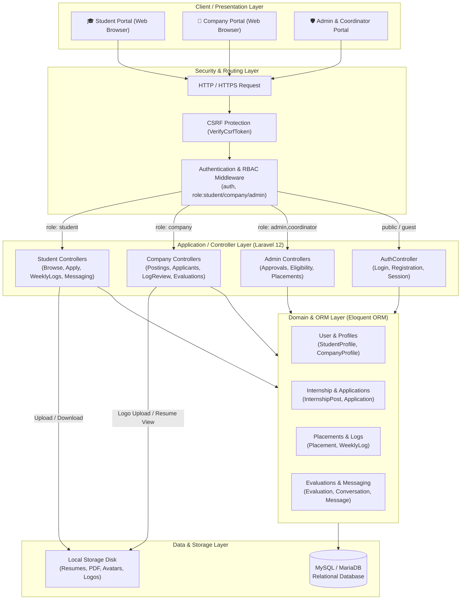
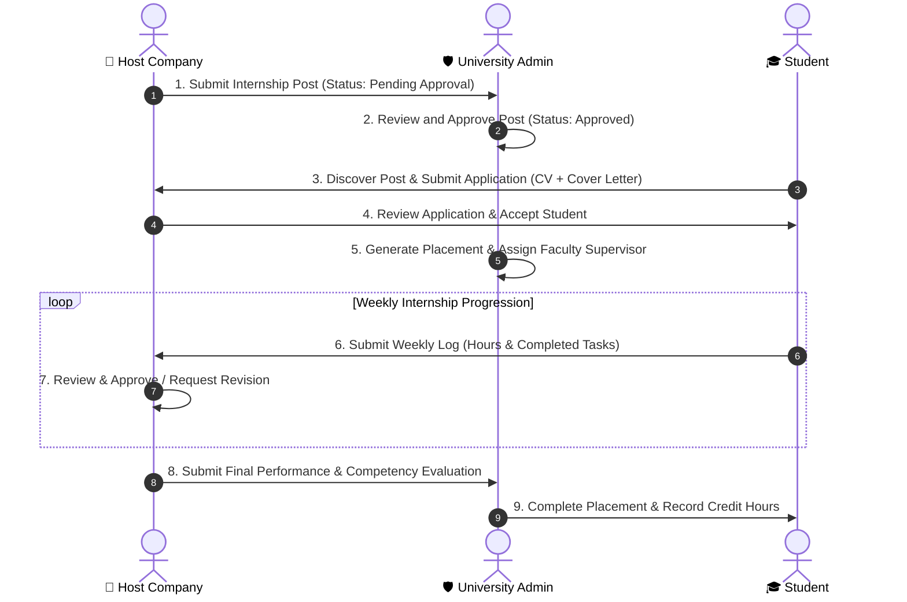

# 🎓 Internship Management System

Internship Management System is a modern, comprehensive web application built with **Laravel 12** and **Tailwind CSS (Vite)**. It bridges the gap between university students, host employers, and faculty coordinators/administrators to streamline internship discovery, applications, weekly logbook reporting, and performance evaluations.

🔗 **GitHub Repository:** [https://github.com/thonpheara/InternshipMS.git](https://github.com/thonpheara/InternshipMS.git)

---

## 📋 Table of Contents
- [Key Features & Roles](#-key-features--roles)
- [System Architecture](#-system-architecture)
- [System Requirements](#-system-requirements)
- [Step-by-Step Installation & Setup](#-step-by-step-installation--setup)
- [Running the Application Locally](#-running-the-application-locally)
- [Default Login Credentials](#-default-login-credentials)
- [Updating the Project After Changes](#-updating-the-project-after-changes)
- [Useful Commands & Troubleshooting](#-useful-commands--troubleshooting)
- [License](#-license)

---

## ✨ Key Features & Roles

- 🎓 **Student Portal:**
  - Browse verified corporate internship listings with category & salary filters.
  - Apply with resumes, cover letters, and track application statuses.
  - Submit weekly logbooks and track approved internship hours.
  - Complete personalized profile (academic track, skills, GPA, contact info).

- 🏢 **Host Company Portal:**
  - Publish and manage internship job postings (Web, Mobile, Backend, Frontend, DevOps, etc.).
  - Review applicant pipeline (accept, reject, or short-list students).
  - Inspect and approve student weekly activity logs.
  - Submit final competency evaluations and performance ratings.

- 🛡️ **University Administrator & Coordinator Portal:**
  - Moderate and approve corporate job postings before public listing.
  - Supervise student eligibility and track cohort placement statuses.
  - Assign faculty supervisors to active placements.
  - System-wide dashboard analytics.

---

## 🏗️ System Architecture

Internship Management System implements a multi-tier **Model-View-Controller (MVC)** architectural pattern built on top of the Laravel 12 framework. The architecture enforces separation of concerns across presentation, routing & middleware, application controllers, domain models, and relational persistence.

For an in-depth technical specification, see [docs/SYSTEM_ARCHITECTURE.md](docs/SYSTEM_ARCHITECTURE.md).

### 1. High-Level Architectural Diagram



### 2. Core Business Workflow Lifecycle



### 3. Layered Components Breakdown

| Layer | Technologies & Components | Core Responsibility |
| :--- | :--- | :--- |
| **Presentation Tier** | Blade Templates, Tailwind CSS 4, Vite, Alpine.js / Vanilla JS | Responsive role-specific dashboards, dynamic modals, data tables, resume previews, and real-time form validations. |
| **Routing & Middleware** | Laravel Web Router (`routes/web.php`), RBAC Middleware | Request dispatching, session state validation, CSRF verification, and strict role guards (`role:student`, `role:company`, `role:admin,coordinator`). |
| **Application Tier** | PHP 8.2+, Laravel 12 Controllers | Request validation, file processing (resumes & images), business logic orchestration, and response view rendering. |
| **Domain & Data Tier** | Eloquent ORM Models (`User`, `Application`, `Placement`, etc.) | Domain relationships (hasOne, hasMany, belongsTo), cascading constraints, soft deletes, and timestamp management. |
| **Storage & Persistence** | MySQL 8.x / MariaDB, Filesystem (`storage/app/public`) | Relational transaction integrity, foreign key relations, and secure document storage for student resumes and company logos. |

---

## 💻 System Requirements

Before running the project locally, make sure you have:
- **PHP** >= 8.2 (with `pdo_mysql`, `fileinfo`, `mbstring`, `openssl` enabled)
- **Composer** (PHP dependency manager)
- **Node.js** (v18.x or later) & **npm**
- **MySQL / MariaDB** (via XAMPP, Laragon, WampServer, or native MySQL server)
- **Git**

---

## 🚀 Step-by-Step Installation & Setup

### Step 1: Clone the Repository
```bash
git clone https://github.com/thonpheara/InternshipMS.git
cd InternshipMS
```

---

### Step 2: Install Dependencies

1. **Install PHP Dependencies (Composer):**
   ```bash
   composer install
   ```

2. **Install Node.js Dependencies (npm):**
   ```bash
   npm install
   ```

---

### Step 3: Configure Environment File (`.env`)

1. **Copy the example environment file:**
   - **Windows (PowerShell):**
     ```powershell
     Copy-Item .env.example .env
     ```
   - **Windows (CMD):**
     ```cmd
     copy .env.example .env
     ```
   - **Linux / macOS:**
     ```bash
     cp .env.example .env
     ```

2. **Generate the Application Key:**
   ```bash
   php artisan key:generate
   ```

---

### Step 4: Configure the Database

1. **Start your MySQL server** (e.g., click **Start** for Apache and MySQL in XAMPP / Laragon).
2. **Create Database:** Create a new database named `intern_db` in phpMyAdmin (`http://localhost/phpmyadmin`) or via MySQL CLI.
3. **Verify Database settings in `.env`:**
   ```env
   APP_NAME="Internship Management System"

   DB_CONNECTION=mysql
   DB_HOST=127.0.0.1
   DB_PORT=3306
   DB_DATABASE=intern_db
   DB_USERNAME=root
   DB_PASSWORD=
   ```

---

### Step 5: Run Database Migrations & Seeders

Run the database schema migrations and seed the initial administrator account:
```bash
php artisan migrate --seed
```

> **Tip:** If you need to wipe and reset with clean seed data at any time:
> ```bash
> php artisan migrate:fresh --seed
> ```

---

### Step 6: Create Storage Symbolic Link

To ensure uploaded resumes, student avatars, and company logos display properly:
```bash
php artisan storage:link
```

---

## 🏃 Running the Application Locally

Keep both the **Laravel backend** and the **Vite frontend** servers running during development:

### Option A: Running in Two Terminals (Recommended)

1. **Terminal 1 — Laravel Backend Server:**
   ```bash
   php artisan serve
   ```
   *Runs at `http://127.0.0.1:8000`*

2. **Terminal 2 — Vite Hot-Reload:**
   ```bash
   npm run dev
   ```

---

### Option B: Single Command Launch
```bash
composer run dev
```

---

## 🔑 Default Login Credentials

### 1. System Administrator
- **Login URL:** `http://127.0.0.1:8000/login`
- **Email:** `admin@gmail.com`
- **Password:** `1234567890`
- **Role:** Full administrative privileges

### 2. Student & Company Accounts
- Both students and host companies can register directly via the self-service signup portal:
- **Registration URL:** `http://127.0.0.1:8000/register`

---

## 🔄 Updating the Project After Changes

When pulling new updates or modifying code:

```bash
# 1. Pull latest commits
git pull origin main

# 2. Run new migrations (if database tables changed)
php artisan migrate

# 3. Clear application caches
php artisan optimize:clear

# 4. Build or restart dev servers
npm run build     # (or 'npm run dev' for local development)
```

---

## 🛠 Useful Commands & Troubleshooting

| Action | Command / Solution |
| :--- | :--- |
| **Clear all Laravel caches** | `php artisan optimize:clear` |
| **Compile assets for production** | `npm run build` |
| **Fix broken image / avatar links** | `php artisan storage:link` |
| **Reset entire database** | `php artisan migrate:fresh --seed` |
| **List all routes** | `php artisan route:list` |
| **Database connection error** | Verify MySQL service is active and credentials match `.env`. |

---

## 📄 License
This project is open-source software licensed under the [MIT license](https://opensource.org/licenses/MIT).
