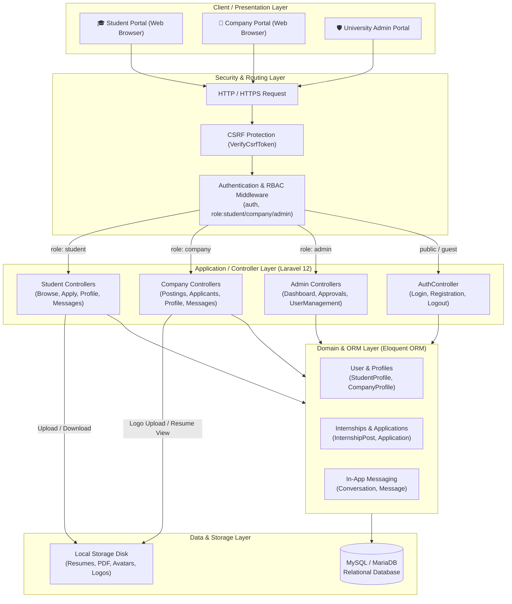
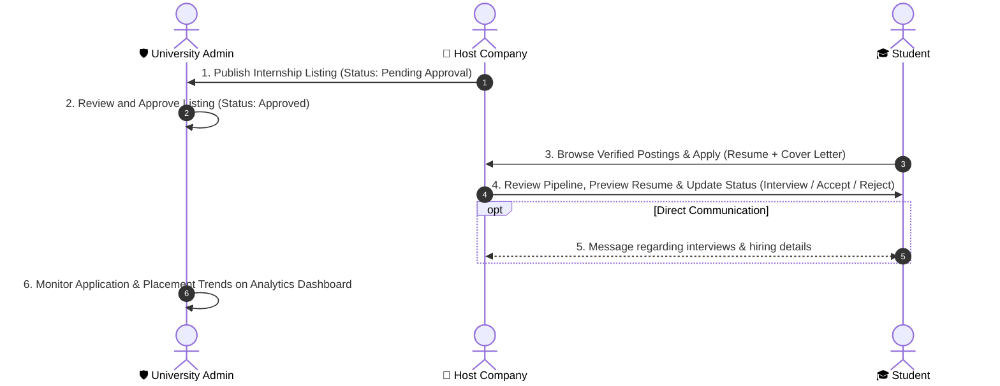

# 🎓 Internship Management System

Internship Management System is a modern, comprehensive web application built with **Laravel 12**, **Tailwind CSS**, **Alpine.js**, and **Vite**. It bridges the gap between university students, host employers, and university administrators to streamline internship discovery, candidate applications, job post moderation, in-app messaging, and placement analytics.

🔗 **GitHub Repository:** [https://github.com/thonpheara/InternshipMS.git](https://github.com/thonpheara/InternshipMS.git)

---

## 📋 Table of Contents
- [Key Features & Roles](#-key-features--roles)
- [System Architecture](#-system-architecture)
- [System Requirements](#-system-requirements)
- [Step-by-Step Installation & Setup](#-step-by-step-installation--setup)
- [Running the Application Locally](#-running-the-application-locally)
- [Running Automated Tests](#-running-automated-tests)
- [Default Login Credentials](#-default-login-credentials)
- [Updating the Project After Changes](#-updating-the-project-after-changes)
- [Useful Commands & Troubleshooting](#-useful-commands--troubleshooting)
- [License](#-license)

---

## ✨ Key Features & Roles

### 🎓 Student Portal
- **Internship Discovery:** Browse approved corporate postings with dynamic search, salary filter, workplace type (On-site, Hybrid, Remote), and department category tags.
- **Application Submission:** Apply with a customized cover letter and attached PDF resume.
- **Resume Management:** Dedicated resume upload and browser-native PDF preview/download, stored in isolated student directories (`storage/app/public/resumes/{student_id}/`).
- **Direct Messaging:** Communicate directly with employers regarding active applications.
- **Status Tracking:** Real-time visibility into application progress (*Applied*, *Interviewed*, *Accepted*, *Rejected*).
- **Student Profile:** Complete personalized academic track, university ID, major, GPA, skills, and contact details.

### 🏢 Host Company Portal
- **Internship Management:** Post and edit vacancy listings with requirements, stipend disclosure, available slots, and application deadlines (held for administrative approval).
- **Applicant Pipeline Board:** View candidacies across pipeline stages, inspect cover letters, preview or download student resumes, and update application statuses.
- **Direct Messaging:** Real-time messaging with prospective student interns per application.
- **Company Profile:** Update corporate profile, industry, website, hiring contact person, and official logo.

### 🛡️ University Administrator Portal
- **Executive Dashboard:** High-level metrics for Total Accounts, Student Interns & Eligibility, Host Companies, Active Status, and Pending Moderation counts.
- **Application & Placement Trends Chart:** Interactive monthly analytics chart (powered by Chart.js & Alpine.js) comparing **Total Applications Submitted** vs. **Accepted Placements**, with **This Year** and **Last Year** dynamic data toggling.
- **Job Post Moderation Queue:** Review, approve, or reject employer postings before public listing.
- **User Management (CRUD):** Full management of student and company accounts with modal-based creation, editing, status changes, and soft-deletes.
- **Clean Single-Screen UI (100vh):** Optimized viewport height layout ensuring clean dashboard data presentation without unnecessary page scrolling.

---

## 🏗️ System Architecture

Internship Management System implements a multi-tier **Model-View-Controller (MVC)** architectural pattern built on the Laravel 12 framework. The architecture enforces separation of concerns across presentation, routing & middleware, application controllers, domain models, and relational persistence.

For an in-depth technical specification, see [docs/SYSTEM_ARCHITECTURE.md](docs/SYSTEM_ARCHITECTURE.md).

### 1. High-Level Architectural Diagram



### 2. Core Business Workflow Lifecycle



### 3. Layered Components Breakdown

| Layer | Technologies & Components | Core Responsibility |
| :--- | :--- | :--- |
| **Presentation Tier** | Blade Templates, Tailwind CSS, Alpine.js, Chart.js, Vite | Responsive role-specific dashboards, dynamic modal popups, resume PDF viewer, and real-time form validation. |
| **Routing & Middleware** | Laravel Web Router (`routes/web.php`), RBAC Middleware | Request dispatching, session state validation, CSRF verification, and strict role guards (`role:student`, `role:company`, `role:admin`). |
| **Application Tier** | PHP 8.2+, Laravel 12 Controllers | Request validation, secure file handling (PDF resumes & logos), business logic orchestration, and view rendering. |
| **Domain & Data Tier** | Eloquent ORM Models (`User`, `StudentProfile`, `CompanyProfile`, `InternshipPost`, `Application`, `Conversation`, `Message`) | Relationships (hasOne, belongsTo, hasMany), cascading constraints, soft deletes, and automatic timestamps. |
| **Storage & Persistence** | MySQL 8.x / MariaDB, Filesystem (`storage/app/public`) | Relational transaction integrity, foreign key relations, and secure document storage for student resumes and company logos. |

---

## 💻 System Requirements

Before running the project locally, make sure you have:
- **PHP** >= 8.2 (with `pdo_mysql`, `fileinfo`, `mbstring`, `openssl` extensions enabled)
- **Composer** (PHP dependency manager)
- **Node.js** (v18.x or later) & **npm**
- **MySQL / MariaDB** (via XAMPP, Laragon, WampServer, or native MySQL server)
- **Git**

---

## 🚀 Step-by-Step Installation & Setup

### Step 1: Clone the Repository
```bash
git clone https://github.com/thonpheara/InternshipMS.git
cd InternshipMS
```

---

### Step 2: Install Dependencies

1. **Install PHP Dependencies (Composer):**
   ```bash
   composer install
   ```

2. **Install Node.js Dependencies (npm):**
   ```bash
   npm install
   ```

---

### Step 3: Configure Environment File (`.env`)

1. **Copy the example environment file:**
   - **Windows (PowerShell):**
     ```powershell
     Copy-Item .env.example .env
     ```
   - **Windows (CMD):**
     ```cmd
     copy .env.example .env
     ```
   - **Linux / macOS:**
     ```bash
     cp .env.example .env
     ```

2. **Generate the Application Key:**
   ```bash
   php artisan key:generate
   ```

---

### Step 4: Configure the Database

1. **Start your MySQL server** (e.g., Apache & MySQL in XAMPP / Laragon).
2. **Create Database:** Create a new database named `intern_db` in phpMyAdmin (`http://localhost/phpmyadmin`) or via MySQL CLI:
   ```sql
   CREATE DATABASE intern_db CHARACTER SET utf8mb4 COLLATE utf8mb4_unicode_ci;
   ```
3. **Verify Database settings in `.env`:**
   ```env
   APP_NAME="Internship Management System"

   DB_CONNECTION=mysql
   DB_HOST=127.0.0.1
   DB_PORT=3306
   DB_DATABASE=intern_db
   DB_USERNAME=root
   DB_PASSWORD=
   ```

---

### Step 5: Run Database Migrations & Seeders

Run the database schema migrations and seed the initial data:
```bash
php artisan migrate --seed
```

> **Tip:** If you need to wipe and reset with clean seed data at any time:
> ```bash
> php artisan migrate:fresh --seed
> ```

---

### Step 6: Create Storage Symbolic Link

To ensure uploaded student resumes, avatars, and company logos display properly:
```bash
php artisan storage:link
```

---

## 🏃 Running the Application Locally

Keep both the **Laravel backend** and the **Vite frontend** servers running during development:

### Option A: Running in Two Terminals (Recommended)

1. **Terminal 1 — Laravel Backend Server:**
   ```bash
   php artisan serve
   ```
   *Runs at `http://127.0.0.1:8000`*

2. **Terminal 2 — Vite Hot-Reload:**
   ```bash
   npm run dev
   ```

---

### Option B: Single Command Launch
```bash
composer run dev
```

---

## 🧪 Running Automated Tests

The application includes automated Feature and Unit tests covering Authentication, User Management, Resume Upload/Preview, Dashboard Analytics, and Role-Based Access Control:

```bash
php artisan test
```

---

## 🔑 Default Login Credentials

### 1. System Administrator
- **Login URL:** `http://127.0.0.1:8000/login`
- **Email:** `admin@gmail.com`
- **Password:** `1234567890`
- **Role:** Full administrative privileges

### 2. Student & Company Accounts
- Both students and host companies can register directly via the self-service signup portal:
- **Registration URL:** `http://127.0.0.1:8000/register`

---

## 🔄 Updating the Project After Changes

When pulling new updates or modifying code:

```bash
# 1. Pull latest commits
git pull origin main

# 2. Run new migrations
php artisan migrate

# 3. Clear application caches
php artisan optimize:clear

# 4. Build or restart dev servers
npm run build     # (or 'npm run dev' for local development)
```

---

## 🛠 Useful Commands & Troubleshooting

| Action | Command / Solution |
| :--- | :--- |
| **Run automated test suite** | `php artisan test` |
| **Clear all Laravel caches** | `php artisan optimize:clear` |
| **Compile assets for production** | `npm run build` |
| **Fix broken image / resume links** | `php artisan storage:link` |
| **Reset entire database with seeds** | `php artisan migrate:fresh --seed` |
| **List all application routes** | `php artisan route:list` |
| **Database connection error** | Verify MySQL service is running and credentials match `.env`. |

---

## 📄 License
This project is open-source software licensed under the [MIT license](https://opensource.org/licenses/MIT).
