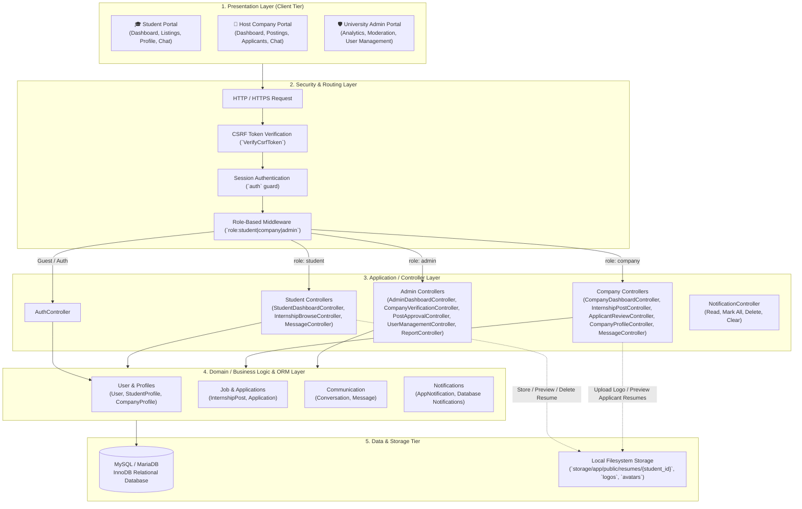
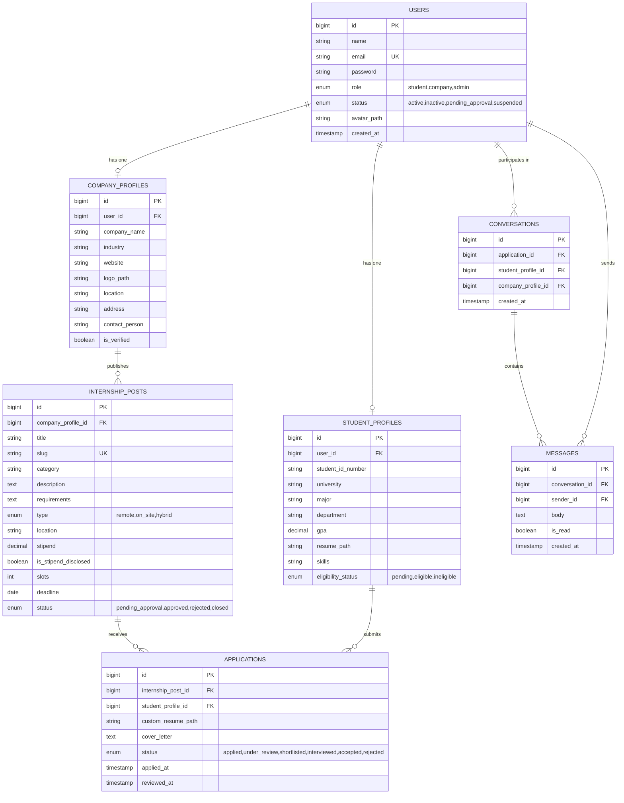

# 🏛️ System Architecture Specification

**Project Name:** Internship Management System  
**Framework:** Laravel 12 (PHP 8.2+)  
**Frontend Stack:** Tailwind CSS, Vite, Blade Templates, Alpine.js, Chart.js  
**Database:** MySQL / MariaDB  
**Repository:** [https://github.com/thonpheara/InternshipMS.git](https://github.com/thonpheara/InternshipMS.git)  

---

## 1. Executive Overview

The **Internship Management System** is a unified multi-role web platform designed to automate and streamline the full lifecycle of university internship programs. It bridges three primary user domains:

1. **Undergraduate Students** seeking internship opportunities, customizing academic profiles, uploading isolated PDF resumes, tracking multi-stage application statuses, and messaging prospective employers.
2. **Host Companies** publishing internship vacancies, reviewing applicant pipelines, assessing PDF resumes via built-in browser previews, updating hiring statuses, and communicating with candidates.
3. **University Administrators** moderating corporate postings, analyzing institutional application and placement trends via dynamic charts, managing student and employer accounts via modal CRUD, and monitoring program health.

---

## 2. High-Level Architectural Pattern

The application implements a classic **Multi-Tier Model-View-Controller (MVC)** architecture. This ensures modularity, clean separation of concerns, testability, and high maintainability.

---

## 3. Detailed Layer Specifications

### 3.1 Presentation Layer (User Interface)
- **Blade Templating Engine:** Component-driven layouts (`resources/views/layouts/`, `components/`) providing shared navigation bars, responsive sidebars, flash alerts, and breadcrumbs.
- **Tailwind CSS (via Vite):** Utility-first styling enabling responsive layouts (mobile, tablet, desktop) without bulky legacy CSS frameworks.
- **Single-Screen UI (100vh Viewport Layout):** Dashboard and management pages are designed with calculated viewport heights (`h-[calc(100vh-19rem)]`, `h-[calc(100vh-12rem)]`) with internal scrolling containers, eliminating unwanted whole-page scrollbars.
- **Dynamic Charting (Chart.js & Alpine.js):** Interactive monthly bar charts with period filtering (This Year vs. Last Year) aggregating real database metrics with zero page reloads.
- **Modal-Based Operations:** Alpine.js powers lightweight modal interactions for creating, editing, and previewing postings and users without navigational disruptions.
- **Embedded Document Previewer:** Direct browser PDF preview functionality for student resumes without requiring third-party plugins.

### 3.2 Routing & Security Layer
- **Centralized Route Definition:** Located in `routes/web.php` with distinct prefix groupings:
  - `/` — Role-based root redirector.
  - `/login`, `/register`, `/logout` — Public guest authentication and session termination.
  - `/student/*` — Protected by `['auth', 'role:student']`.
  - `/company/*` — Protected by `['auth', 'role:company']`.
  - `/admin/*` — Protected by `['auth', 'role:admin']`.
- **Cross-Site Request Forgery (CSRF):** Enabled on all POST, PUT, and DELETE forms via `@csrf`.
- **Session Security:** Standard HTTP-only, encrypted session cookies prevent session hijacking and cross-site scripting (XSS) leaks.

### 3.3 Application Layer (Controllers)
Controllers encapsulate incoming HTTP requests, coordinate with models, perform authorization checks, and return formatted responses:
- **`Student/` Controllers:**
  - `StudentDashboardController`: Profile configuration, academic track, skills, GPA, and isolated resume upload/preview/download/deletion.
  - `InternshipBrowseController`: Listing discovery with search and category filtering, application submission with cover letters.
  - `MessageController`: Direct real-time messaging between students and prospective employers for active applications.
- **`Company/` Controllers:**
  - `CompanyDashboardController`: Key recruitment statistics and candidate submission overviews.
  - `CompanyProfileController`: Organization details, website, industry, hiring contact person, and logo upload.
  - `InternshipPostController`: CRUD operations for vacancy posts (submit for admin moderation, update, manage slots & stipends).
  - `ApplicantReviewController`: Candidate assessment, PDF resume preview/download, and status transitions (`pending`, `shortlisted`, `interviewed`, `accepted`, `rejected`).
  - `MessageController`: Application-bound messaging with student candidates.
- **`Admin/` Controllers:**
  - `AdminDashboardController`: Key institutional metrics and real-time monthly **Application & Placement Trends** analytics chart.
  - `CompanyVerificationController`: Review, verify, or reject employer registrations with formal feedback notes.
  - `PostApprovalController`: Content moderation queue for reviewing, approving, or rejecting employer listings.
  - `ReportController`: Comprehensive placement & outcome reporting, multi-dimensional filters, CSV export, and print-ready academic audit layouts.
  - `UserManagementController`: Full CRUD operations for Student and Company accounts with modal dialogs, status updates, and soft deletes.
- **`NotificationController`:**
  - Interactive topbar drawer actions: mark as read with deep-linked routing, mark all read, delete single notification, and clear all.

### 3.4 Domain / ORM Layer (Eloquent ORM)
Eloquent models serve as the programmatic abstraction over the database:
- **Encapsulated Relationships:**
  - `User` ⟷ `StudentProfile` / `CompanyProfile` (1:1)
  - `CompanyProfile` ⟷ `InternshipPost` (1:N)
  - `InternshipPost` ⟷ `Application` (1:N)
  - `StudentProfile` ⟷ `Application` (1:N)
  - `Conversation` ⟷ `Message` (1:N)
  - `User` ⟷ `Message` (Sender, 1:N)
  - `User` ⟷ `DatabaseNotification` (`notifications` table via `Notifiable` trait)
- **Data Integrity:** Soft deletes (`SoftDeletes`) maintain historical audit trails for users and postings.

### 3.5 Persistence & Storage Layer
- **MySQL / MariaDB Database:** ACID-compliant relational data store using UTF-8 Unicode (`utf8mb4`). Foreign key constraints guarantee referential integrity (`cascadeOnDelete`, `nullOnDelete`).
- **Isolated Directory Storage:** Resumes are saved in student-specific paths (`storage/app/public/resumes/{student_id}/{filename}.pdf`) to guarantee student privacy and avoid file collision.
- **Storage Access & Fallback:** Publicly accessible via `php artisan storage:link`, with a streaming fallback route in `routes/web.php` for seamless hosting across local and production environments.

---

## 4. Role-Based Access Control (RBAC) Matrix

| Resource / Action | Guest | Student | Company | Admin |
| :--- | :---: | :---: | :---: | :---: |
| **Browse Public Landing & Login** | ✅ | ✅ | ✅ | ✅ |
| **Register (Self-service)** | ✅ | ✅ | ✅ | ❌ |
| **In-App Notification Drawer & Bell** | ❌ | ✅ | ✅ | ✅ |
| **Manage Student Profile & Resume** | ❌ | ✅ | ❌ | ❌ |
| **Browse & Apply to Approved Posts** | ❌ | ✅ | ❌ | ❌ |
| **Direct Messaging (Active Applications)** | ❌ | ✅ | ✅ | ❌ |
| **Manage Company Profile & Logo** | ❌ | ❌ | ✅ | ❌ |
| **Post & Manage Internship Opportunities**| ❌ | ❌ | ✅ | ❌ |
| **Review Applicants & Preview Resumes** | ❌ | ❌ | ✅ | ❌ |
| **Update Applicant Status (Accept/Reject)**| ❌ | ❌ | ✅ | ❌ |
| **Verify & Moderate Company Accounts** | ❌ | ❌ | ❌ | ✅ |
| **Moderate & Approve Job Postings** | ❌ | ❌ | ❌ | ✅ |
| **View Institutional Trends Analytics** | ❌ | ❌ | ❌ | ✅ |
| **User Management (CRUD Students/Companies)**| ❌ | ❌ | ❌ | ✅ |
| **Placement & Outcome Reports (CSV & Print)**| ❌ | ❌ | ❌ | ✅ |

---

## 5. Entity-Relationship (ER) Architecture

---

## 6. End-to-End Workflow Lifecycles

### 6.1 Job Posting & Moderation Lifecycle
1. **Creation:** Host Company submits a vacancy posting detailing responsibilities, qualifications, stipend, available positions, and application deadline.
2. **Moderation Queue:** The posting immediately enters the Admin Review Queue (`pending_approval`).
3. **Admin Decision:**
   - **Approval:** Admin approves the listing, updating status to `approved`. The post immediately becomes visible and searchable across the Student Portal.
   - **Rejection:** Admin rejects the post, notifying the employer for revisions.

### 6.2 Application & Candidate Selection Lifecycle
1. **Discovery & Application:** Student discovers an approved listing, reviews details, and applies with a tailored cover letter and attached resume.
2. **Pipeline Processing:** Host Company receives the application on the Pipeline Board and reviews the candidate:
   - Preview or download the candidate's PDF resume directly in-browser.
   - Progress the candidate through stages: `applied` ➔ `under_review` ➔ `shortlisted` ➔ `interviewed` ➔ `accepted` or `rejected`.
3. **Outcome Notification:** Student immediately sees updated status badges on their Applications dashboard.

### 6.3 Direct Messaging Lifecycle
1. **Initiation:** From an active application, either the student or the employer initiates a direct conversation thread.
2. **Real-Time Exchange:** Messages are exchanged regarding interview times, technical assessments, and onboarding logistics.
3. **Read Tracking:** Unread message badges notify users of new communications.

### 6.4 Institutional Analytics & Monitoring Lifecycle
1. **Dynamic Data Aggregation:** The Admin Dashboard automatically aggregates monthly applications submitted versus accepted offers across the current and preceding calendar years.
2. **Visual Assessment:** University leadership tracks placement momentum and student success rates using the interactive Chart.js visualization.
3. **Account Supervision:** Administrators manage student and company accounts with inline modal editing and status controls.

### 6.5 Company Onboarding & Verification Lifecycle
1. **Self-Service Registration:** A company registers through `/register`, generating a `CompanyProfile` flagged with `verification_status: 'pending'`.
2. **Administrative Moderation:** The profile enters `/admin/companies`. Admins inspect the organization's name, website, industry, contact person, and address.
3. **Approval / Rejection:** The admin approves or rejects the registration with an explanatory note. The decision dispatches an immediate `AppNotification` to the company.

### 6.6 Universal In-App Notification Dispatch Lifecycle
1. **Event Trigger:** System events (new applications, candidate stage updates, post moderation outcomes, account verifications) trigger Laravel's `Notification::send()` or `$user->notify(new AppNotification(...))`.
2. **Persistence:** The notification is stored in the `notifications` relational table with title, message, and direct deep-link `action_url`.
3. **Delivery & Interaction:** The recipient's topbar notification bell displays an unread count badge. Clicking any notification marks it as read and redirects directly to the target record.

### 6.7 Placement & Institutional Outcome Reporting Lifecycle
1. **Multi-Dimensional Querying:** Administrators access `/admin/reports` to inspect institutional placement rates filtered by Academic Year, Department/Major, Company, Status, or Date Range.
2. **Metric Computation:** Aggregate metrics (Total Applicants, Placements, Active Companies, Placement Rate %) calculate in real time.
3. **Distribution & Archival:** Administrators can export the dataset as a standard CSV (`/admin/reports/export-csv`) or open the dedicated print layout (`/admin/reports/print`) styled with `@media print` CSS for official university audit documentation.

---

## 7. Security Architecture & Threat Mitigation

| Security Concern | Mechanism Implemented |
| :--- | :--- |
| **Authentication & Brute Force** | Built-in Laravel Auth Guard, password hashing with `bcrypt` (work factor 12), rate-limiting middleware on login endpoints. |
| **Role-Based Access Control (RBAC)** | Strict `RoleMiddleware` enforcement guarding routes (`role:student`, `role:company`, `role:admin`) and redirecting unauthorized access to role dashboards. |
| **SQL Injection** | PDO prepared statements and Eloquent ORM parameter binding across all database queries. |
| **Cross-Site Scripting (XSS)** | Blade automatic output escaping (`{{ $variable }}`) converts special characters to HTML entities. |
| **Cross-Site Request Forgery (CSRF)**| Encrypted session tokens checked on all mutating HTTP methods (`POST`, `PUT`, `PATCH`, `DELETE`). |
| **Insecure Direct Object Reference (IDOR)**| Route-level authorization and controller-level ownership verification (e.g., companies can only modify their own posts). |
| **File Upload Vulnerabilities** | Strict MIME-type validation (`application/pdf` for resumes, `image/jpeg,png,webp` for logos/avatars), isolated subfolder storage (`resumes/{student_id}/`), and file extension sanitization. |

---

## 8. Technology Stack Summary

- **Backend Runtime:** PHP 8.2+
- **Application Framework:** Laravel 12.x
- **ORM / Database Layer:** Eloquent ORM / MySQL 8.x or MariaDB 10.x
- **Frontend Compiler:** Vite 5.x / 6.x
- **CSS Framework:** Tailwind CSS
- **Interactivity & Charts:** Alpine.js, Chart.js
- **Font & Icons:** Plus Jakarta Sans, FontAwesome 6
- **Package Managers:** Composer (PHP) & npm (JavaScript)
