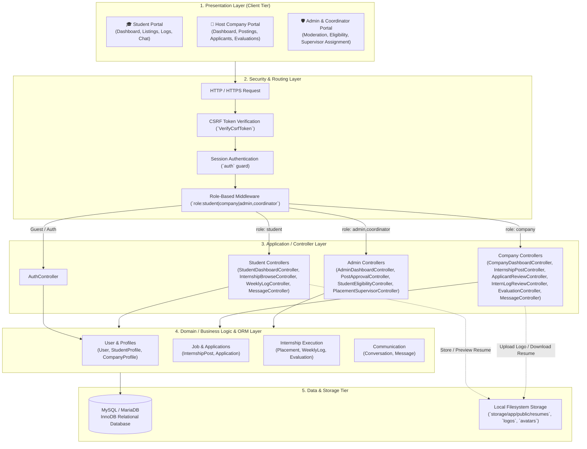
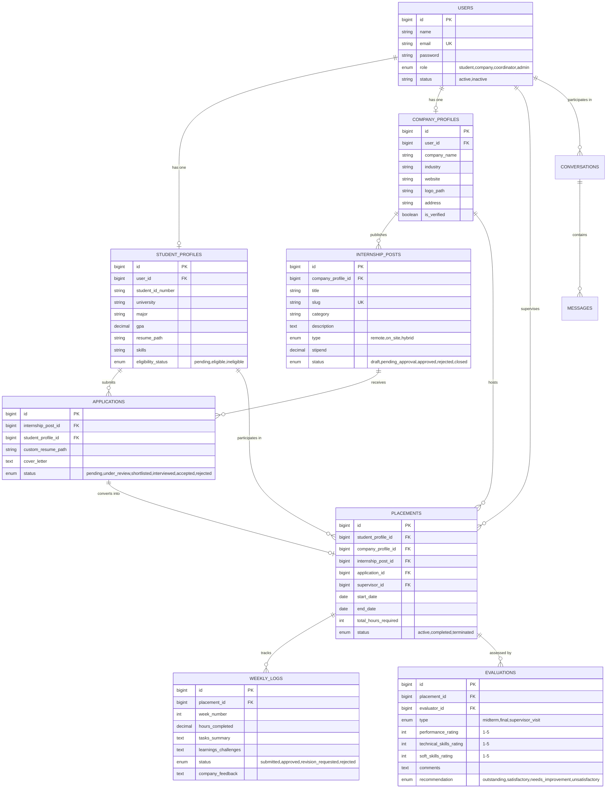

# 🏛️ System Architecture Specification

**Project Name:** Internship Management System (SmartIntern)  
**Framework:** Laravel 12 (PHP 8.2+)  
**Frontend Stack:** Tailwind CSS 4, Vite, Blade Templates, Alpine.js / Vanilla JS  
**Database:** MySQL / MariaDB  
**Repository:** [https://github.com/thonpheara/InternshipMS.git](https://github.com/thonpheara/InternshipMS.git)  

---

## 1. Executive Overview

The **Internship Management System** is a unified multi-role web platform designed to automate and streamline the full lifecycle of university internship programs. It bridges three primary user domains:

1. **Undergraduate Students** seeking internships, tracking applications, submitting weekly logbooks, and communicating with employers.
2. **Host Companies** advertising positions, reviewing applicant pipelines, approving weekly activities, and completing evaluations.
3. **University Faculty Coordinators & Administrators** moderating job opportunities, supervising student eligibility, allocating academic supervisors, and monitoring cohort completion rates.

---

## 2. High-Level Architectural Pattern

The application implements a classic **Multi-Tier Model-View-Controller (MVC)** architecture. This ensures modularity, clean separation of concerns, testability, and high maintainability.

---

## 3. Detailed Layer Specifications

### 3.1 Presentation Layer (User Interface)
- **Blade Templating Engine:** Component-driven layouts (`resources/views/layouts/`) providing shared navigation bars, responsive sidebars, flash alerts, and breadcrumbs.
- **Tailwind CSS (via Vite):** Utility-first styling enabling responsive layouts (mobile, tablet, desktop) without bulky legacy CSS frameworks.
- **Micro-Interactions & Modals:** Alpine.js and lightweight JavaScript handle dynamic modal popups (e.g., application confirmation, rejection reasoning, image lightboxes, log details).
- **Embedded Document Previewer:** Direct browser PDF preview functionality for student resumes without requiring external plugins.

### 3.2 Routing & Security Layer
- **Centralized Route Definition:** Located in `routes/web.php` with distinct prefix groupings:
  - `/` — Root redirector based on authenticated role.
  - `/login`, `/register`, `/logout` — Unauthenticated/Guest and session termination routes.
  - `/student/*` — Protected by `['auth', 'role:student']`.
  - `/company/*` — Protected by `['auth', 'role:company']`.
  - `/admin/*` — Protected by `['auth', 'role:admin,coordinator']`.
- **Cross-Site Request Forgery (CSRF):** Enabled on all POST, PUT, and DELETE forms via `@csrf`.
- **Session Security:** Standard HTTP-only, encrypted session cookies prevent session hijacking and cross-site scripting (XSS) leaks.

### 3.3 Application Layer (Controllers)
Controllers encapsulate incoming HTTP requests, coordinate with models, perform authorization checks, and return formatted responses:
- **`Student/` Controllers:**
  - `StudentDashboardController`: Profile configuration, academic track, skills, GPA, and resume management.
  - `InternshipBrowseController`: Listing discovery with search and category filtering, application submission.
  - `WeeklyLogController`: Weekly hour logging, task summaries, and reflection reports.
  - `MessageController`: Application-bound messaging between student and prospective employer.
- **`Company/` Controllers:**
  - `CompanyProfileController`: Organization details, website, industry, and logo uploads.
  - `InternshipPostController`: CRUD operations for job posts (draft, publish, manage requirements).
  - `ApplicantReviewController`: Candidate assessment, resume review, status transitions (`pending`, `shortlisted`, `accepted`, `rejected`).
  - `InternLogReviewController`: Logbook review, hours approval, and feedback entry.
  - `EvaluationController`: Midterm and final competency evaluations.
- **`Admin/` Controllers:**
  - `AdminDashboardController`: Aggregated program metrics and system overview.
  - `PostApprovalController`: Content moderation queue for employer listings.
  - `StudentEligibilityController`: Verification of academic standing and internship readiness.
  - `PlacementSupervisorController`: Faculty supervisor allocation to active student placements.

### 3.4 Domain / ORM Layer (Eloquent ORM)
Eloquent models serve as the programmatic abstraction over the database:
- **Encapsulated Relationships:**
  - `User` ⟷ `StudentProfile` / `CompanyProfile` (1:1)
  - `CompanyProfile` ⟷ `InternshipPost` (1:N)
  - `InternshipPost` ⟷ `Application` (1:N)
  - `StudentProfile` ⟷ `Application` (1:N)
  - `Application` ⟷ `Placement` (1:1)
  - `Placement` ⟷ `WeeklyLog` (1:N)
  - `Placement` ⟷ `Evaluation` (1:N)
  - `Placement` ⟷ `User` (Supervisor, N:1)
  - `Conversation` ⟷ `Message` (1:N)
- **Data Integrity:** Soft deletes (`SoftDeletes`) maintain historical audit trails for job postings, placements, and user records.

### 3.5 Persistence & Storage Layer
- **MySQL / MariaDB Database:** ACID-compliant relational data store using UTF-8 Unicode (`utf8mb4`). Foreign key constraints guarantee referential integrity (`cascadeOnDelete`, `nullOnDelete`).
- **Filesystem Disk Storage:** Stored in `storage/app/public/`:
  - `resumes/`: Uploaded student CVs/resumes (PDF format).
  - `company_logos/`: Corporate branding images.
  - `avatars/`: User profile pictures.
- **Storage Access & Fallback:** Publicly symlinked via `php artisan storage:link`, with a fallback route in `routes/web.php` for seamless hosting across various server environments.

---

## 4. Role-Based Access Control (RBAC) Matrix

| Resource / Action | Guest | Student | Company | Coordinator | Admin |
| :--- | :---: | :---: | :---: | :---: | :---: |
| **Browse Public Landing & Login** | ✅ | ✅ | ✅ | ✅ | ✅ |
| **Register (Self-service)** | ✅ | ✅ | ✅ | ❌ | ❌ |
| **Manage Student Profile & Resume** | ❌ | ✅ | ❌ | ❌ | ❌ |
| **Browse & Apply to Approved Posts** | ❌ | ✅ | ❌ | ❌ | ❌ |
| **Submit Weekly Logbooks** | ❌ | ✅ | ❌ | ❌ | ❌ |
| **Post Internship Opportunities** | ❌ | ❌ | ✅ | ❌ | ❌ |
| **Review Applicants & Resumes** | ❌ | ❌ | ✅ | ❌ | ❌ |
| **Approve / Reject Student Logs** | ❌ | ❌ | ✅ | ❌ | ❌ |
| **Submit Midterm / Final Evaluations**| ❌ | ❌ | ✅ | ❌ | ❌ |
| **Moderate & Approve Job Postings** | ❌ | ❌ | ❌ | ✅ | ✅ |
| **Manage Student Eligibility** | ❌ | ❌ | ❌ | ✅ | ✅ |
| **Assign Faculty Supervisors** | ❌ | ❌ | ❌ | ✅ | ✅ |
| **System Dashboard & Global Analytics**| ❌ | ❌ | ❌ | ✅ | ✅ |

---

## 5. Entity-Relationship (ER) Architecture

---

## 6. End-to-End Workflow Lifecycles

### 6.1 Job Posting & Moderation Lifecycle
1. **Creation:** Company drafts or submits an internship post with duration, stipend, category, and requirements.
2. **Review:** The listing enters the Admin Moderation Queue (`pending_approval`).
3. **Decision:**
   - If approved by Admin, status updates to `approved` and becomes searchable in the Student Portal.
   - If rejected, a rejection reason is recorded, and the company can modify and resubmit.

### 6.2 Application & Placement Lifecycle
1. **Submission:** An eligible student submits an application attaching either their default profile CV or a customized resume.
2. **Employer Review:** Company reviews applicant details, checks resume preview, and transitions status:
   - `under_review` ➔ `shortlisted` ➔ `interviewed` ➔ `accepted` / `rejected`.
3. **Placement Creation:** When an application is marked `accepted`, a `Placement` record is automatically or administratively generated.
4. **Faculty Assignment:** University administrators assign a designated faculty supervisor to monitor academic credit compliance.

### 6.3 Logbook & Evaluation Lifecycle
1. **Weekly Logging:** Student logs hours worked (e.g., 40 hours/week) along with accomplishments and challenges.
2. **Supervisor/Host Review:** Company mentor verifies hours and either approves the log or requests revisions.
3. **Evaluation:** Upon internship conclusion, the host employer submits a formal evaluation rating technical skills, communication, and attendance on a 1–5 scale.
4. **Credit Verification:** Final evaluation and accumulated approved hours are verified by university coordinators for academic credit clearance.

---

## 7. Security Architecture & Threat Mitigation

| Security Concern | Mechanism Implemented |
| :--- | :--- |
| **Authentication & Brute Force** | Built-in Laravel Auth Guard, password hashing with `bcrypt` (work factor 12), rate-limiting middleware on login endpoints. |
| **SQL Injection** | PDO prepared statements and Eloquent ORM parameter binding across all database queries. |
| **Cross-Site Scripting (XSS)** | Blade automatic output escaping (`{{ $variable }}`) converts special characters to HTML entities. |
| **Cross-Site Request Forgery (CSRF)**| Encrypted session tokens checked on all mutating HTTP methods (`POST`, `PUT`, `PATCH`, `DELETE`). |
| **Insecure Direct Object Reference (IDOR)**| Route-level RBAC and controller-level ownership verification (e.g., companies can only modify their own posts). |
| **File Upload Vulnerabilities** | Strict MIME-type validation (`application/pdf` for resumes, `image/jpeg,png,webp` for logos/avatars), sanitized filenames, and storage outside public root. |

---

## 8. Technology Stack Summary

- **Backend Runtime:** PHP 8.2+
- **Application Framework:** Laravel 12.x
- **ORM / Database Layer:** Eloquent ORM / MySQL 8.x or MariaDB 10.x
- **Frontend Compiler:** Vite 5.x / 6.x
- **CSS Framework:** Tailwind CSS 4.x
- **Icons & UI Enhancements:** Lucide Icons / Heroicons, Alpine.js
- **Package Managers:** Composer (PHP) & npm (JavaScript)
